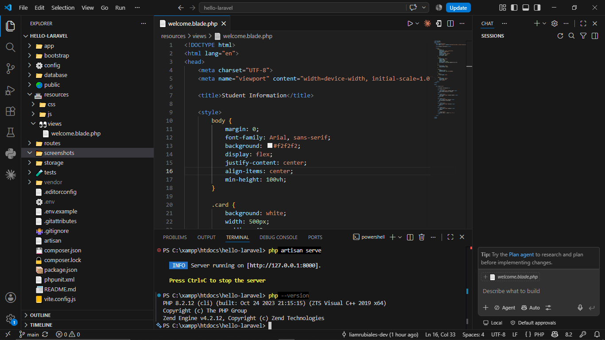
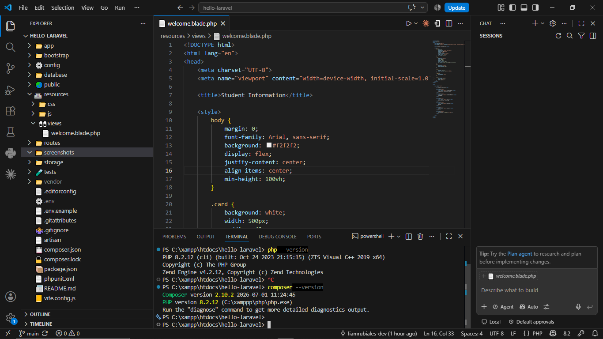
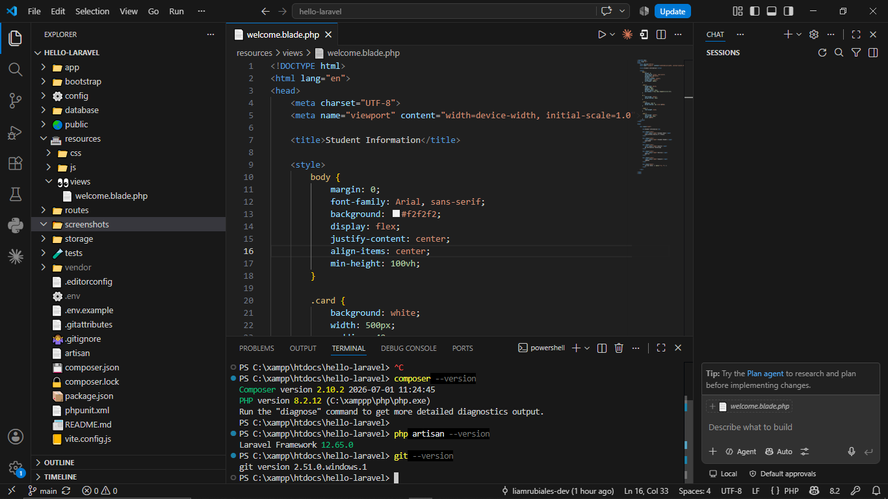
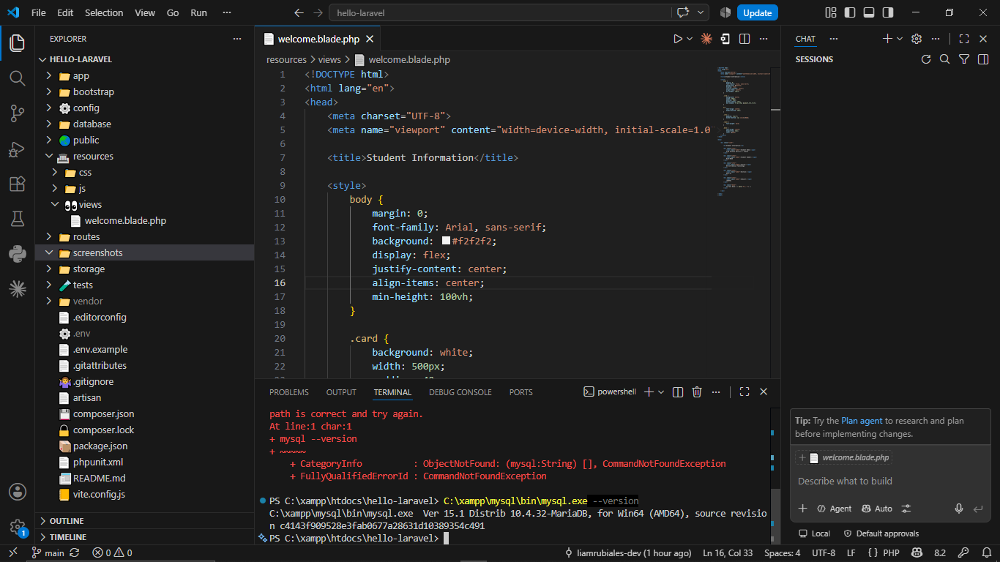
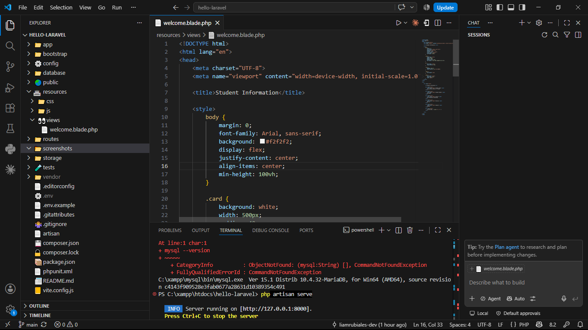
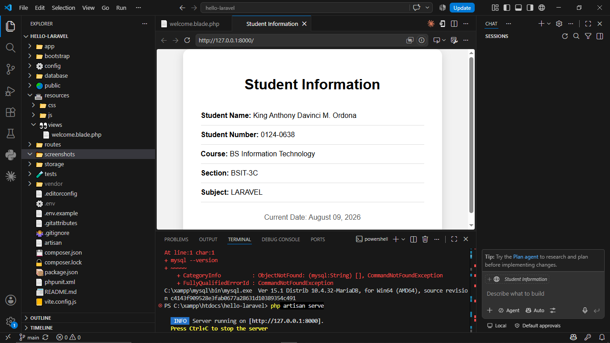

# Laravel Client-Server Technologies

## 1. Project Title

Laravel Client-Server Technologies – Laravel Setup and Installation

## 2. Introduction

### Brief Overview of Laravel

Laravel is a PHP web application framework designed to make web development easier, faster, and more organized. It provides useful features for routing, database management, authentication, and application development.

### Importance of Client-Server Technologies

Client-server technologies allow users to interact with applications through a client, such as a web browser, while the server processes requests, manages data, and sends responses back to the client. These technologies are important in developing modern web applications.

### Purpose of the Project

The purpose of this project is to install and configure Laravel in a Windows development environment using XAMPP, PHP, Composer, Git, MySQL, and Visual Studio Code. The project also demonstrates how to create, run, and upload a Laravel project to GitHub.

## 3. Objectives

At the end of the activity, the following objectives were achieved:

1. Install and configure the required Laravel development environment.
2. Verify the PHP installation and PHP version.
3. Install and verify Composer.
4. Create and run a Laravel project using XAMPP.
5. Open and edit the Laravel project using Visual Studio Code.
6. Run the Laravel development server successfully.
7. Create a customized Laravel webpage.
8. Use Git for version control and upload the Laravel project to GitHub.
9. Document the installation process using screenshots.

## 4. Development Environment

| Component | Version |
|---|---|
| Operating System | Windows 10 |
| PHP | 8.2 |
| Laravel | [11.] |
| Composer | [2.10] |
| Git | [2.51] |
| MySQL | [8.0] |
| Visual Studio Code | [1.9] |

## 5. Installation Steps

### Step 1 – Install XAMPP

XAMPP was installed and used as the local development environment for PHP and MySQL.

### Step 2 – Verify PHP

PHP was verified through the Command Prompt to make sure that PHP was properly installed and accessible.

### Step 3 – Verify Composer

Composer was installed and verified using the Composer version command.

### Step 4 – Create the Laravel Project

The Laravel project was created inside the XAMPP `htdocs` directory.

The project location was:

## 6. Project Structure

Laravel uses an organized folder structure where each folder has a specific purpose.

### app/

The `app/` folder contains the main application code. It includes important files such as models, controllers, and other classes used to build the application's functionality.

### routes/

The `routes/` folder contains the application's route definitions. It determines which code or page should respond when a user visits a specific URL.

For example, the `web.php` file contains routes for web pages.

### resources/

The `resources/` folder contains the application's views and frontend resources. It includes Blade templates, CSS, and JavaScript files.

The `resources/views/` folder contains the Blade files used to display webpages.

### public/

The `public/` folder contains files that are publicly accessible by users. It also contains the main entry point of the Laravel application, `index.php`.

### config/

The `config/` folder contains configuration files for the Laravel application. These files define settings for different parts of the system, such as the database, application, and services.

### database/

The `database/` folder contains files related to database management. It includes migrations, seeders, and factories that are used to create, populate, and manage database structures and test data.

## 7. Problems Encountered

During the Laravel installation and setup, several challenges were encountered.

### 1. Composer Was Not Recognized

At first, the Command Prompt showed that `composer` was not recognized as an internal or external command. This happened because Composer was not yet properly installed or recognized by the system.

### 2. MySQL Was Not Recognized

When the command `mysql --version` was entered, the system initially showed that `mysql` was not recognized. Although MariaDB was already included with XAMPP, its executable folder was not yet included in the Windows PATH.

### 3. Git Push Was Rejected

When the Laravel project was first pushed to GitHub, the push was rejected because the remote repository already contained changes that were not available in the local repository. The terminal displayed a `fetch first` message.

### 4. Difficulty Opening the Laravel Project

Another challenge was locating the Laravel project folder and opening it correctly in Visual Studio Code. The project was eventually located in:

`C:\xampp\htdocs\hello-laravel`

and successfully opened in VS Code.

## 8. Solutions

### 1. Solution to the Composer Problem

Composer was installed using the official Composer Windows installer. After installation, a new Command Prompt was opened to refresh the system PATH. The command `composer -V` was then used to verify that Composer was working correctly.

The installed Composer version was verified successfully.

### 2. Solution to the MySQL Problem

The `mysql --version` command was initially not recognized. Since XAMPP was being used, the MySQL-compatible MariaDB installation was located inside:

`C:\xampp\mysql\bin`

This folder was added to the Windows PATH environment variable. A new Command Prompt was then opened and the command `mysql --version` was used again. The command successfully displayed the MariaDB version.

### 3. Solution to the Git Push Problem

The first `git push` attempt was rejected because the GitHub repository already contained changes that were not available in the local repository.

The problem was solved by synchronizing the local repository with GitHub using:

`git pull --rebase origin main`

After the rebase was completed successfully, the project was pushed again using:

`git push origin main`

The second push was successful.

### 4. Solution to the Laravel Project Location Problem

The Laravel project was initially difficult to locate and open in Visual Studio Code. The project was found inside the XAMPP `htdocs` directory:

`C:\xampp\htdocs\hello-laravel`

The project was then opened in Visual Studio Code and verified by checking the Laravel folders and files such as `app/`, `routes/`, `resources/`, `public/`, `config/`, `database/`, `artisan`, and `composer.json`.

## 9. Screenshots

The following screenshots document the installation, configuration, and development process of the Laravel project.

### Screenshot 1 – PHP Version

This screenshot shows the PHP version installed and verified through the Command Prompt.

### Screenshot 2 – Composer Installation and Verification

This screenshot shows the successful installation and verification of Composer.

### Screenshot 3 – Laravel Installer Verification

This screenshot shows the Laravel Installer version successfully verified using the `laravel -V` command.

### Screenshot 4 – Git Version

This screenshot shows the Git version installed and successfully verified using the `git --version` command.

### Screenshot 5 – MySQL/MariaDB Version

This screenshot shows the MySQL-compatible MariaDB version included with XAMPP and successfully verified.

### Screenshot 6 – Laravel Project in Visual Studio Code

This screenshot shows the `hello-laravel` project opened in Visual Studio Code.

### Screenshot 7 – Laravel Development Server

This screenshot shows the Laravel development server running successfully using the `php artisan serve` command.

### Screenshot 8 – Laravel Project / Homepage

This screenshot shows the Laravel project running successfully in the local development environment.

## 10. Reflection

1. During the activity I’ve learned how to install and configure the software needed to develop laravel apps such as PHP, Composer and Git. I’ve also learned how to create a project by using Composer, and how to run my project by using the laravel development server. One thing I liked about the activity is that it teaches how to customize the laravel homepage by editing the welcome.blade.php file. I was also able to put my own student information such as my name, student no. course, section, subject and present date to display in the laravel page. Through this activity I was able to understand how laravel uses the blade templating engine to generate dynamic web pages.

2. I also faced a number of challenges while performing the activity. One challenge I faced was identifying the location of the Laravel project folder within the XAMPP htdocs folder. Initially, I was not sure which folder to open in Visual Studio. Another challenge I encountered was setting up Git and ensuring that my local repository was connected to the correct GitHub repository. While making the connection, I used the wrong repository link with YOUR-USERNAME in the URL. This led to my project not being pushed to the wrong repository. However, I resolved this problem by double-checking the repository link in my GitHub account and pushing the project to the correct repository.

3. Laravel is one of the essential tools for client-server development since it offers a framework that allows developers to build modern web applications by dividing them into multiple convenient parts. The tool helps create an application with organized routing, views, controllers, and other parts and add required elements. It also has built-in functionalities for requests, authentication, databases, and servers and supports developers’ productivity and good coding practices.

4. The knowledge that I was able to gain through the described activity would help me in my future software development endeavors since now I have an idea about the creation, personalization, testing, and maintenance of a web application using version control. In addition, I have seen the importance of learning Git and GitHub since they allow me to store my code safely and track my progress using Git repositories. Therefore, the activity that I have undertaken helped me learn and practice the development of Laravel applications and client-server development since it has increased my confidence in creating and maintaining versions of applications in the future.

## 11. References

Composer. (n.d.). *Composer documentation*. https://getcomposer.org/doc/

Git. (n.d.). *Git documentation*. https://git-scm.com/doc

Laravel. (n.d.). *Laravel documentation*. https://laravel.com/docs

PHP Documentation Group. (n.d.). *PHP manual*. https://www.php.net/manual/en/
